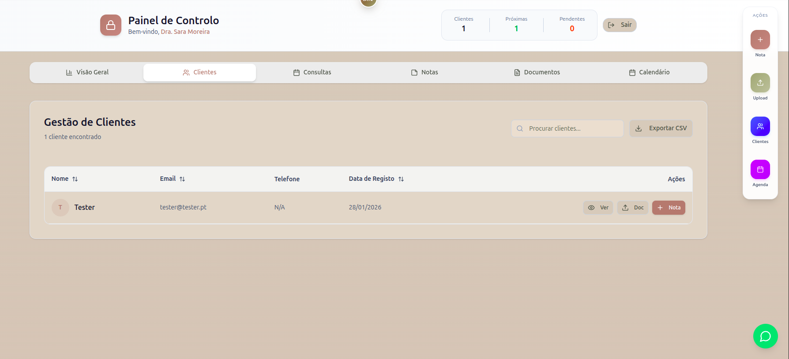
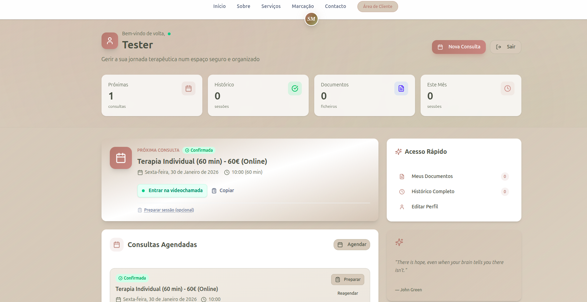
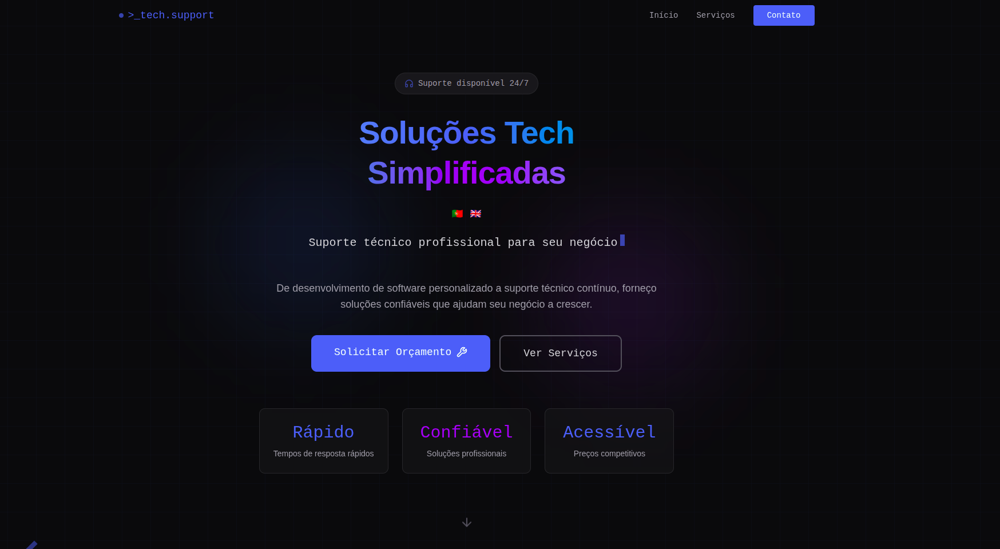
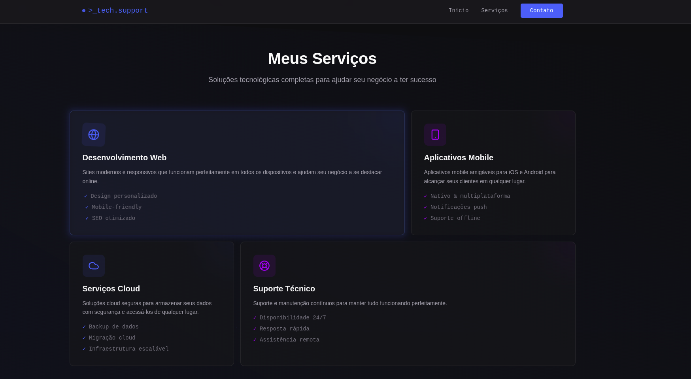
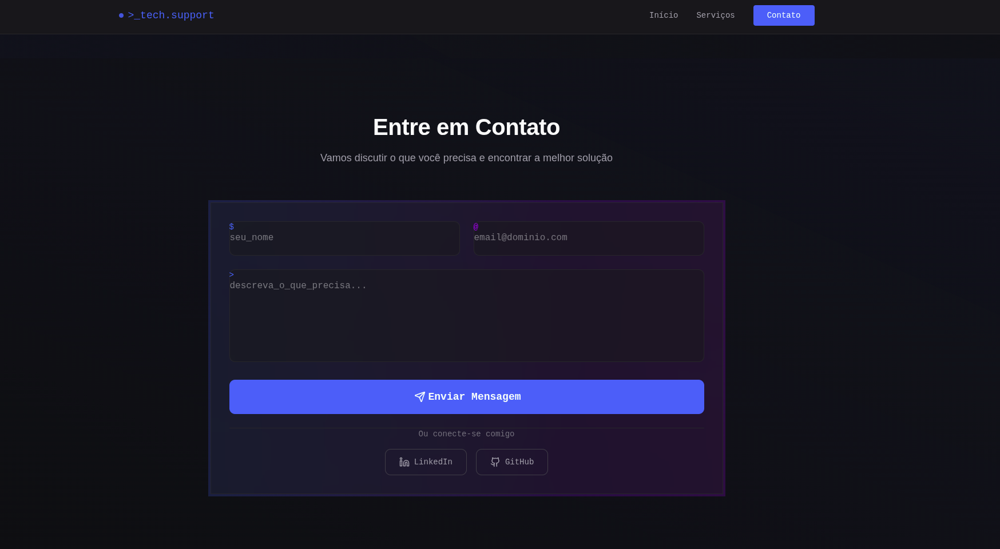
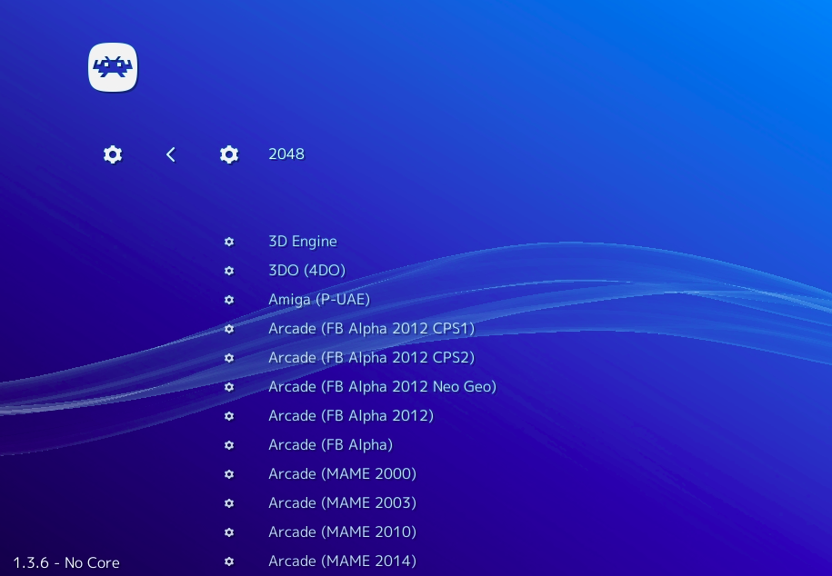
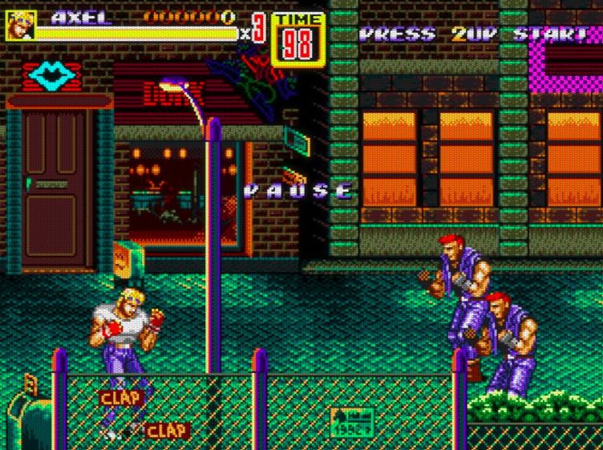
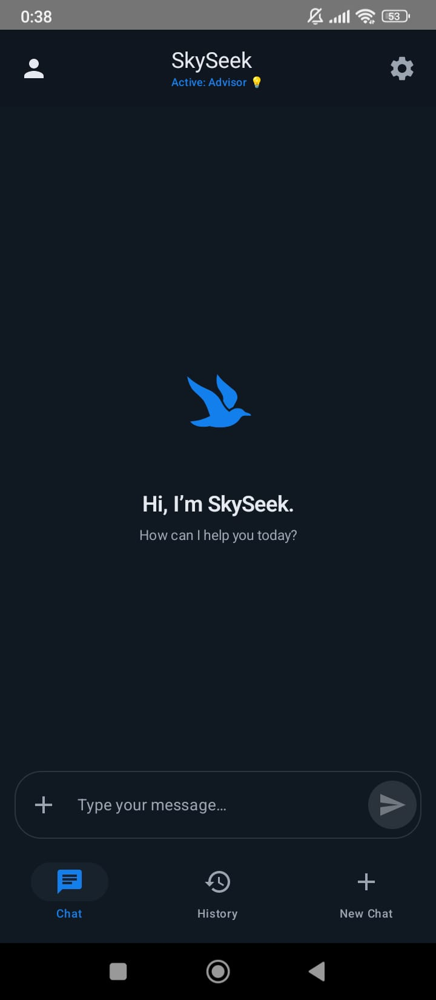
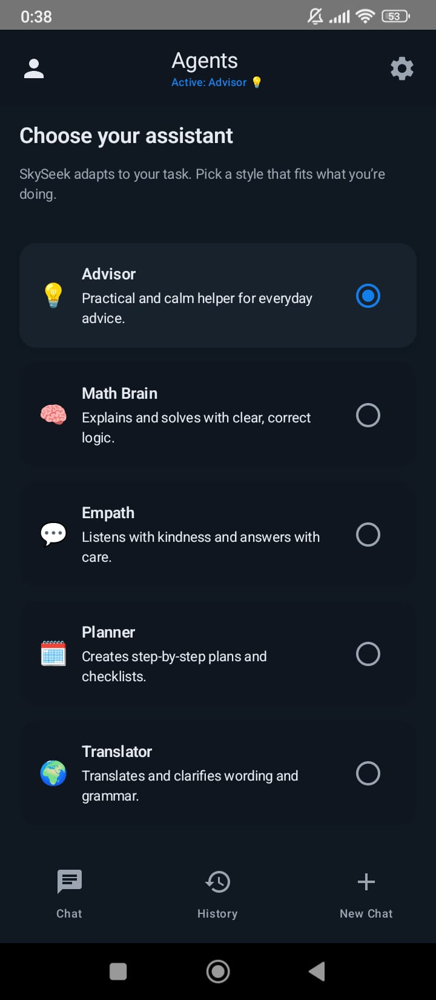
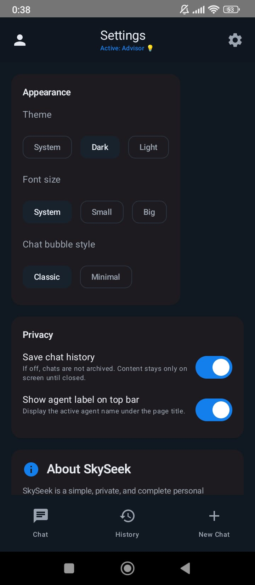

  
  
  

---

  
# 👋 Hi, I'm Diogo Serra

  
  ### 🚀 Tech Solutions Made Simple | Full-Stack Development & Technical Support
  

---

## 💼 About Me

  
**I specialize in custom software development and professional technical support, helping businesses grow through reliable and efficient tech solutions.**

From web applications to mobile apps and system automation, I deliver solutions that make a real impact.

  
🎯 **Available for freelance projects and technical consulting**  
⚡ **24/7 support mindset** - Fast, reliable, and professional

---

## 🚀 Featured Projects

### [C Odyssey](https://github.com/TheTimelessRecall/C-Odyssey)
A comprehensive library of algorithms in C - the perfect starting point for developers diving into low-level programming. Collection of essential data structures and algorithms to build a solid foundation.

---

### [PSI Production Website](https://github.com/Diogo-Serra/website-psi_prod)
Full-featured clinic management system with client area and admin panel. Designed for psychology clinics but highly adaptable to any healthcare or service business. Includes appointment scheduling, patient management, and secure authentication.

  <table>
    <tr>
      <td align="center">
        
      </td>
      <td align="center">
        
      </td>
      <td align="center">
        
      </td>
    </tr>
    <tr>
      <td align="center"><b>🏠 Home Interface</b></td>
      <td align="center"><b>📊 Client Dashboard</b></td>
      <td align="center"><b>⚙️ Admin Panel</b></td>
    </tr>
  </table>

---

### [Personal Portfolio](https://github.com/Diogo-Serra/mywebsite)
Clean and modern portfolio website to showcase professional information. Built with React and TypeScript, featuring smooth animations and fully responsive design. Perfect template for developers looking to establish their online presence.

  <table>
    <tr>
      <td align="center">
        
      </td>
      <td align="center">
        
      </td>
      <td align="center">
        
      </td>
    </tr>
    <tr>
      <td align="center"><b>✨ Hero Section</b></td>
      <td align="center"><b>💼 Projects Gallery</b></td>
      <td align="center"><b>📬 Contact Form</b></td>
    </tr>
  </table>

---

### [RetroGameMachine](https://github.com/Diogo-Serra/RetroGameMachine)
Transform any PC into a retro gaming console! Complete setup to play classic games from multiple vintage systems. Nostalgic interface with modern convenience.

  <table>
    <tr>
      <td align="center">
        
      </td>
      <td align="center">
        
      </td>
      <td align="center">
        
      </td>
    </tr>
    <tr>
      <td align="center"><b>🎮 Main Menu</b></td>
      <td align="center"><b>📚 Game Library</b></td>
      <td align="center"><b>🕹️ In Action</b></td>
    </tr>
  </table>

---

### [SkySeek](https://github.com/Diogo-Serra/SkySeek)
Clean AI interface for interacting with GPT API. Minimalist design inspired by DeepSeek, providing a straightforward chat experience without the complexity. Perfect for those who want direct access to AI capabilities.

  <table>
    <tr>
      <td align="center">
        
      </td>
      <td align="center">
        
      </td>
      <td align="center">
        
      </td>
    </tr>
    <tr>
      <td align="center"><b>💬 Chat Interface</b></td>
      <td align="center"><b>🤖 AI Conversation</b></td>
      <td align="center"><b>⚡ Settings</b></td>
    </tr>
  </table>

---

## Tech Stack

### Languages

### Frameworks & Libraries

### Databases & Tools

---

## Connect With Me

  
  [LinkedIn](https://www.linkedin.com/in/diogoserra90/) | [GitHub](https://github.com/Diogo-Serra)
  
  ### Open to freelance opportunities and technical consulting
  

---

  
  **"Building reliable tech solutions, one line of code at a time"**
  

